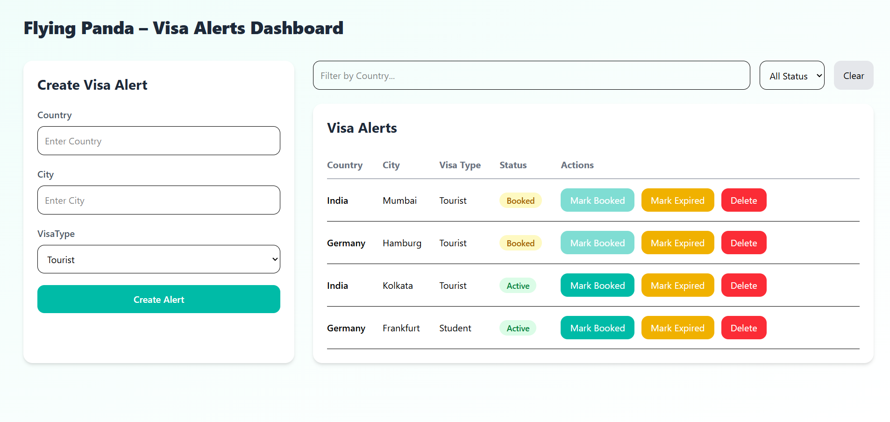
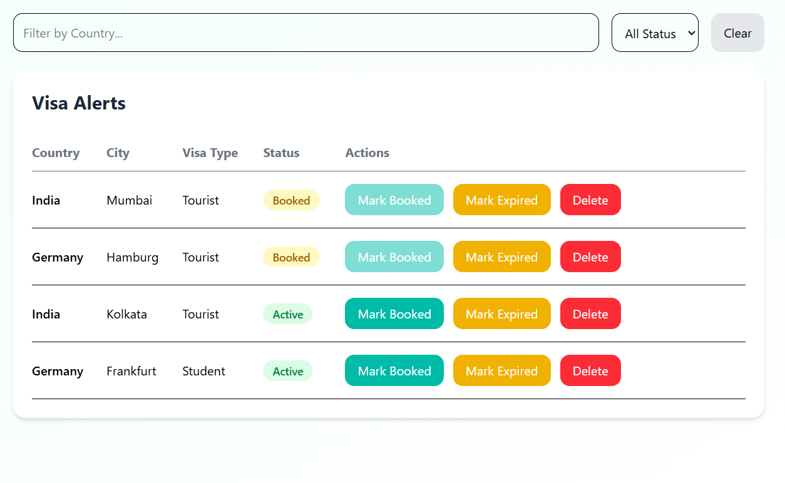

# Visa Alerts Dashboard

A full-stack web application for managing and tracking visa appointment alerts. The project includes a backend REST API built with Node.js and Express, and a modern frontend dashboard developed using Vite, React, and Tailwind CSS.

---

## Project Structure

This repository contains two main folders:

* `backend/` — Express.js server and API layer
* `frontend/` — React + Tailwind dashboard interface

Both must be running simultaneously during development.

---

## Getting Started

### Prerequisites

Ensure the following are installed:

* Node.js (v18 or higher recommended)
* npm

---

## Installation

Clone the repository:

```bash
git clone https://github.com/cipherzyvishu/visa-alert-dashboard-assignment.git
```

Install dependencies for both backend and frontend:

### Backend Setup

```bash
cd backend
npm install
```

### Frontend Setup

```bash
cd frontend
npm install
```

---

## Running the Application

Open **two separate terminals**.

### Terminal 1 — Start Backend Server

```bash
cd backend
npm run dev
```

Backend will run on:

```
http://localhost:3000
```

---

### Terminal 2 — Start Frontend Application

```bash
cd frontend
npm run dev
```

Frontend will run on:

```
http://localhost:5173
```

---

## Technology Stack

### Backend

* Node.js
* Express.js
* REST API architecture

### Frontend

* Vite
* React
* Tailwind CSS

### Storage Layer

Instead of using a database, the application currently uses file-based storage for persistence. This approach keeps the project lightweight while still supporting saved data between sessions.

---

## Design Decisions

The user interface and layout were inspired by the Flying Panda platform itself. The goal was to build a clean and functional dashboard that closely matches real-world visa alert management systems.

---

## AI Assistance

AI tools were helpful during development in the following areas:

* Debugging issues in component rendering and layout
* Improving Tailwind responsiveness and UI structure
* Assisting with the frontend filtering logic implementation

Key parts that required independent reasoning and implementation included:

* Designing REST APIs with correct HTTP status codes
* Structuring backend routes and controllers
* Integrating frontend requests with backend services

---

## Future Improvements

If extended for production deployment, planned enhancements include:

* Database integration (MongoDB or PostgreSQL)
* Authentication and user accounts
* Role-based access control
* Pagination for large datasets
* Improved UI/UX and accessibility
* More scalable backend architecture and validation

---

## Screenshots

Place screenshots inside a `screenshots/` folder in the root directory.

Example:

### Dashboard View

```md

```

### Alerts Table

```md

```

---

## License

This project is intended for evaluation, and demonstration purposes.
